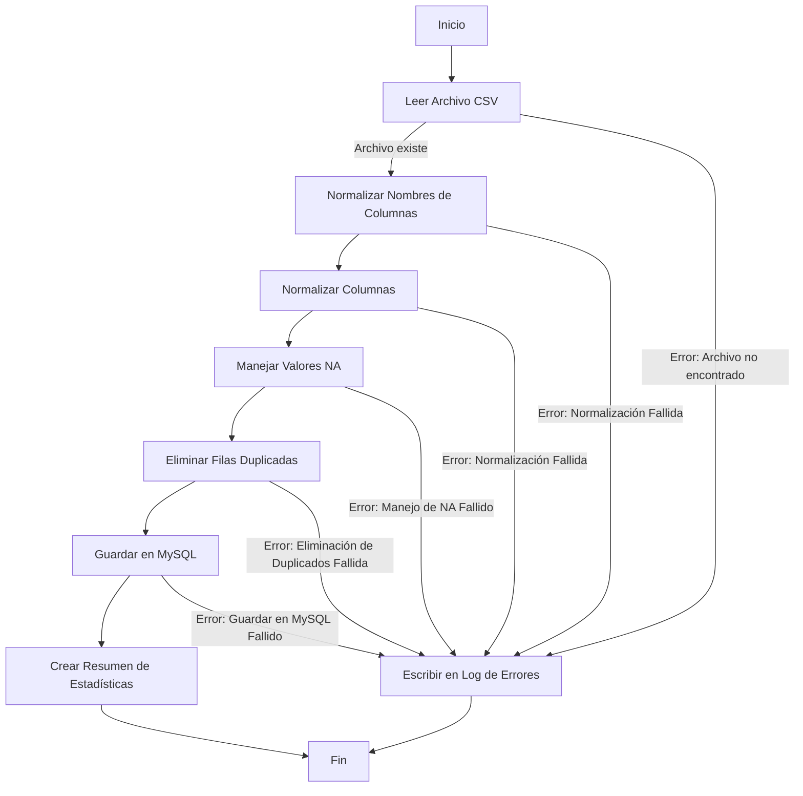

# Proyecto de Importación de Datos a MySQL usando R

Este proyecto tiene como objetivo automatizar el proceso de importación, limpieza y procesamiento de datos desde un archivo CSV a una base de datos MySQL utilizando R. El proyecto fue desarrollado como parte de la cátedra final del curso Programación en R, conducente al grado de Magister en Data Science.

## Funcionalidades

- Lectura de datos desde un archivo CSV.
- Normalización de nombres de columnas y valores.
- Manejo de valores faltantes (NA).
- Eliminación de filas duplicadas.
- Guardado de datos en una tabla MySQL.
- Generación de un resumen de estadísticas.
- Manejo de errores.
- Pruebas unitarias exhaustivas con librería TESTHAT.

## Diagrama de Flujo de la Función importar_a_mysql




Este es un video explicativo de mi proyecto:

[](https://www.youtube.com/watch?v=hrbf_opnc1Q)

En este video, cubro los siguientes puntos:
1. Introducción al proyecto.
2. Explicación del código.
3. Resultados y conclusiones.

## Uso

### Requisitos

- R
- Paquetes: `DBI`, `RMySQL`, `dplyr`, `broom`, `janitor`, `rio`, `stringi`, `testthat`
# Archivos Fuentes

## 1. importa_dataset_to_mysql.R
### Ejecución del Código
```r
# Funciones Jorge Melendez
source("fx_dataset_to_mysql.R")

# Librerías necesarias
library(DBI)       # Para conectar y ejecutar consultas en bases de datos
library(RMySQL)    # Para conectar y manejar bases de datos MySQL

# Conectar a la base de datos MySQL
con <- DBI::dbConnect(RMySQL::MySQL(),
                      dbname = "database name",
                      host = "localhost",
                      port = 3306,
                      user = "user",
                      password = "pass")

# Ejecutar la importación
result <- importar_a_mysql(file_path = "Most Streamed Spotify Songs 2024.csv",
                           table_name = "spotify",
                           db_con = con,
                           metodo_na = "media",
                           encoding = "UTF-8")

# Desconectar de MySQL
dbDisconnect(con)

# Imprimir el resumen de estadísticas
print(result$summary_stats)
```

## 2. fx_dataset_to_mysql.R
### Ejecución del Código
```r
# Librerías necesarias
library(DBI)       # Para conectar y ejecutar consultas en bases de datos
library(RMySQL)    # Para conectar y manejar bases de datos MySQL
library(dplyr)     # Para manipulación de datos
library(ggplot2)   # Para visualización de datos
library(broom)     # Para convertir modelos en dataframes ordenados
library(janitor)   # Para limpiar y normalizar nombres de columnas
library(rio)       # Para importar y exportar datos en diversos formatos
library(stringi)   # Para manipulación y limpieza de cadenas de texto

#' Escribir en el log de errores
#'
#' Registra un mensaje de error con un timestamp en el archivo 'error_log.txt'.
#'
#' @param mensaje Un string con el mensaje de error a registrar.
escribir_log <- function(mensaje) {
  log_file <- "error_log.txt"
  timestamp <- Sys.time()
  write(paste(timestamp, "-", mensaje), log_file, append = TRUE)
}

#' Leer dataset
#'
#' Importa datos desde un archivo especificado y maneja cualquier error que ocurra.
#'
#' @param file_path Ruta al archivo de datos.
#' @param encoding Codificación del archivo de datos (por defecto "UTF-8").
#' @return Un dataframe con los datos importados.
leer_data_set <- function(file_path,
                          encoding = "UTF-8") {
  tryCatch({
    data <- rio::import(file_path, encoding = encoding)
    return(data)
  }, error = function(e) {
    escribir_log(paste("Error en leer_data_set:", e$message))
    stop("Error en leer_data_set. Revisa el log para más detalles.")
  })
}

#' Normalizar nombres de columnas
#'
#' Limpia y normaliza los nombres de las columnas del dataframe.
#'
#' @param data El dataframe cuyas columnas se normalizarán.
#' @return El dataframe con los nombres de las columnas normalizados.
normalizar_nombres_columnas <- function(data) {
  tryCatch({
    data <- clean_names(data)
    return(data)
  }, error = function(e) {
    escribir_log(paste("Error en normalizar_nombres_columnas:", e$message))
    stop("Error en normalizar_nombres_columnas. Revisa el log para más detalles.")
  })
}

#' Normalizar columnas
#'
#' Normaliza las columnas numéricas del dataframe.
#'
#' @param data El dataframe cuyas columnas se normalizarán.
#' @return El dataframe con las columnas normalizadas.
normalizar_columnas <- function(data) {
  tryCatch({
    num_cols <- sapply(data, is.numeric)
    data[num_cols] <- scale(data[num_cols])
    return(data)
  }, error = function(e) {
    escribir_log(paste("Error en normalizar_columnas:", e$message))
    stop("Error en normalizar_columnas. Revisa el log para más detalles.")
  })
}

#' Manejar valores NA
#'
#' Maneja los valores NA en el dataframe, eliminándolos o reemplazándolos por la media de la columna.
#'
#' @param data El dataframe en el cual se manejarán los valores NA.
#' @param metodo Método para manejar los NA ("eliminar" o "media", por defecto "eliminar").
#' @return El dataframe con los valores NA manejados.
manejar_na <- function(data,
                       metodo = "eliminar") {
  tryCatch({
    if (metodo == "eliminar") {
      data <- na.omit(data)
    } else if (metodo == "media") {
      for (col in names(data)) {
        if (is.numeric(data[[col]])) {
          data[[col]][is.na(data[[col]])] <- mean(data[[col]], na.rm = TRUE)
        }
      }
    }
    return(data)
  }, error = function(e) {
    escribir_log(paste("Error en manejar_na:", e$message))
    stop("Error en manejar_na. Revisa el log para más detalles.")
  })
}

#' Eliminar filas duplicadas
#'
#' Elimina las filas duplicadas del dataframe.
#'
#' @param data El dataframe del cual se eliminarán las filas duplicadas.
#' @return El dataframe sin filas duplicadas.
eliminar_filas_duplicadas <- function(data) {
  tryCatch({
    data <- data[!duplicated(data), ]
    return(data)
  }, error = function(e) {
    escribir_log(paste("Error en eliminar_filas_duplicadas:", e$message))
    stop("Error en eliminar_filas_duplicadas. Revisa el log para más detalles.")
  })
}

#' Guardar dataset en MySQL
#'
#' Guarda el dataframe en una tabla de MySQL.
#'
#' @param data El dataframe a guardar.
#' @param table_name Nombre de la tabla en MySQL donde se guardará el dataframe.
#' @param db_con Conexión a la base de datos MySQL.
guardar_en_mysql <- function(data,
                             table_name,
                             db_con) {
  tryCatch({
    dbWriteTable(db_con, table_name, data, overwrite = TRUE, append = FALSE, row.names = FALSE)
  }, error = function(e) {
    escribir_log(paste("Error en guardar_en_mysql:", e$message))
    stop("Error en guardar_en_mysql. Revisa el log para más detalles.")
  })
}

#' Crear resumen de estadísticas
#'
#' Crea un resumen de estadísticas del dataframe.
#'
#' @param data El dataframe del cual se creará el resumen de estadísticas.
#' @return Una lista con el resumen de estadísticas del dataframe.
crear_resumen_estadisticas <- function(data) {
  resumen <- list(
    columnas = ncol(data),
    filas = nrow(data),
    resumen = summary(data)
  )
  return(resumen)
}

#' Importar datos a MySQL
#'
#' Realiza todas las etapas necesarias para importar un archivo a MySQL.
#'
#' @param file_path Ruta al archivo de datos.
#' @param table_name Nombre de la tabla en MySQL donde se guardará el dataframe.
#' @param db_con Conexión a la base de datos MySQL.
#' @param metodo_na Método para manejar los NA ("eliminar" o "media", por defecto "eliminar").
#' @param encoding Codificación del archivo de datos (por defecto "UTF-8").
#' @param limpiar_caracteres Booleano que indica si se deben limpiar caracteres especiales (por defecto TRUE).
#' @return Un objeto de clase DataResult con los resultados del análisis.
importar_a_mysql <- function(file_path,
                             table_name,
                             db_con,
                             metodo_na = "eliminar",
                             encoding = "UTF-8",
                             limpiar_caracteres = TRUE) {
  tryCatch({
    # Limpiar caracteres especiales si se especifica
    if (limpiar_caracteres) {
      file_path_limpio <- tempfile(fileext = ".csv")
      lines <- readLines(file_path, encoding = encoding)
      clean_lines <- stri_replace_all_regex(lines, "[^\x20-\x7E]", "")
      writeLines(clean_lines, file_path_limpio, useBytes = TRUE)
      file_path <- file_path_limpio
    }

    # Leer el dataset
    data <- leer_data_set(file_path, encoding = encoding)

    # Normalizar los nombres de las columnas
    data <- normalizar_nombres_columnas(data)

    # Normalizar las columnas
    data <- normalizar_columnas(data)

    # Manejar valores NA
    data <- manejar_na(data, metodo = metodo_na)

    # Eliminar filas duplicadas
    data <- eliminar_filas_duplicadas(data)

    # Guardar en MySQL
    guardar_en_mysql(data, table_name, db_con)

    # Crear resumen de estadísticas
    resumen_estadisticas <- crear_resumen_estadisticas(data)

    # Crear y retornar el objeto de clase S3
    result <- structure(list(data = data, summary_stats = resumen_estadisticas), class = "DataResult")
    return(result)
  }, error = function(e) {
    escribir_log(paste("Error en importar_a_mysql:", e$message))
    stop("Ocurrió un error durante la importación. Revisa el log para más detalles.")
  })
}

# Definir la clase DataResult
DataResult <- function(data, summary_stats) {
  structure(list(data = data, summary_stats = summary_stats), class = "DataResult")
}
```

## 3. test_importar_a_mysql.R
### Ejecución del Código
```r
# test_importar_a_mysql.R
library(testthat)

# Cargar el archivo de funciones a probar
source("fx_dataset_to_mysql.R")

# Prueba para leer_data_set
test_that("Leer dataset funciona correctamente", {
  data <- leer_data_set("Most Streamed Spotify Songs 2024.csv", encoding = "UTF-8")
  expect_s3_class(data, "data.frame")
  expect_true(ncol(data) > 0)
  expect_true(nrow(data) > 0)
})

# Prueba para normalizar_nombres_columnas
test_that("Normalizar nombres de columnas funciona correctamente", {
  data <- data.frame("Columna 1" = 1:10, "Columna 2" = 11:20)
  data_norm <- normalizar_nombres_columnas(data)
  expect_true(all(colnames(data_norm) == c("columna_1", "columna_2")))
})

# Prueba para manejar_na
test_that("Manejar valores NA funciona correctamente", {
  data <- data.frame("Columna1" = c(1, NA, 3), "Columna2" = c(NA, 2, 3))
  data_na_elim <- manejar_na(data, metodo = "eliminar")
  expect_true(nrow(data_na_elim) == 1)
  data_na_media <- manejar_na(data, metodo = "media")
  expect_true(all(!is.na(data_na_media)))
})

# Prueba para eliminar_filas_duplicadas
test_that("Eliminar filas duplicadas funciona correctamente", {
  data <- data.frame("Columna1" = c(1, 1, 2), "Columna2" = c(3, 3, 4))
  data_sin_dups <- eliminar_filas_duplicadas(data)
  expect_true(nrow(data_sin_dups) == 2)
})

# Prueba para guardar_en_mysql
test_that("Guardar en MySQL funciona correctamente", {
  con <- dbConnect(RMySQL::MySQL(),
                   dbname = "test_function",
                   host = "localhost",
                   port = 3306,
                   user = "usuario_R",
                   password = "ConectaR")
  data <- data.frame("Columna1" = 1:10, "Columna2" = 11:20)
  expect_silent(guardar_en_mysql(data, "test_table", con))
  dbDisconnect(con)
})

# Prueba para importar_a_mysql
test_that("Importar a MySQL funciona correctamente", {
  con <- dbConnect(RMySQL::MySQL(),
                   dbname = "test_function",
                   host = "localhost",
                   port = 3306,
                   user = "usuario_R",
                   password = "ConectaR")
  result <- importar_a_mysql("Most Streamed Spotify Songs 2024.csv", "test_table", con, metodo_na = "media", encoding = "UTF-8")
  expect_s3_class(result, "DataResult")
  expect_true("data" %in% slotNames(result))
  expect_true("summary_stats" %in% slotNames(result))
  dbDisconnect(con)
})
```
## Conclusión

Este proyecto ha sido una valiosa oportunidad para aplicar y consolidar mis conocimientos en programación con R y en el manejo de bases de datos MySQL. A través de este trabajo, he podido automatizar la importación y limpieza de datos, así como realizar análisis de datos de manera eficiente.

Quisiera agradecer a la Universidad y a mis profesores por su guía y apoyo durante todo el curso, tambien a mis compañeros de clase por la disposición a compartir conocimientos. Este proyecto ha sido un reto enriquecedor y una experiencia de aprendizaje fundamental en mi camino hacia el grado de Magister en Data Science.
